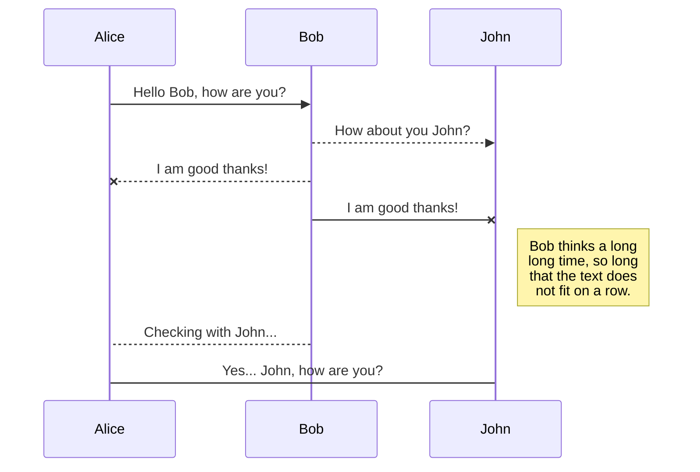

# Welcome to our Data Engineering project!

This project was made on the topic: **Visual History of Nobel Prize Winners**
The link to the dataset can be found on: https://www.datacamp.com/projects/441

# Files
- **Archive.csv** file is the original dataset before any editing was made
-  **Data** folder,  contains the archive.csv file
- **Nobel.ipynb** is the Jupyter Notebook which contains the details of the steps that we used to develop our solution. As well as some visualizations which provide a better understanding of the dataset. 

## Our work flow

## UML diagrams

You can render UML diagrams using [Mermaid](https://mermaidjs.github.io/). For example, this will produce a sequence diagram:

